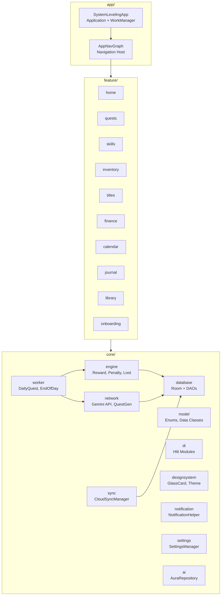
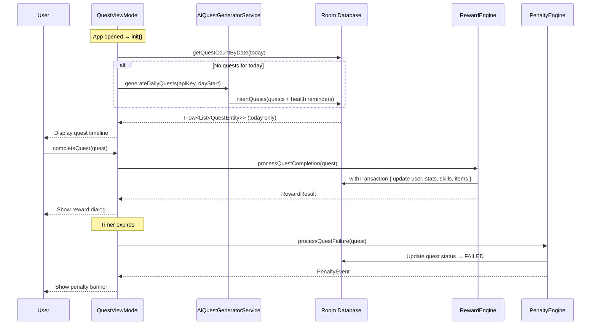
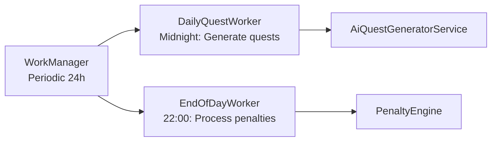

# Architecture — Solo Leveling System

> Kiến trúc Android Native · Kotlin · Jetpack Compose · Room · Hilt DI · WorkManager

---

## Module Structure

---

## Data Flow: Quest Lifecycle

---

## Background Workers

---

## Key Design Decisions

| Decision | Rationale |
|---|---|
| **Room + Flow** | Reactive UI updates từ database, tự động refresh khi data thay đổi |
| **withTransaction** | Atomic reward processing — tránh corrupt state khi app crash giữa chừng |
| **WorkManager periodic** | Background quest generation/penalty xử lý ngay cả khi app đóng |
| **Hilt DI** | Constructor injection cho tất cả Engine, Service, ViewModel |
| **MutableStateFlow + flatMapLatest** | Quest filtering theo ngày tự động refresh khi ngày thay đổi |
| **Component extraction** | UI files tách nhỏ để dễ maintain và review |

---

## Module Dependency Rules

1. `feature/*` → phụ thuộc vào `core/` (one-way)
2. `core/` modules **không** phụ thuộc vào `feature/`
3. `app/` → phụ thuộc vào cả `feature/` và `core/`
4. Tránh circular dependency giữa các feature modules
